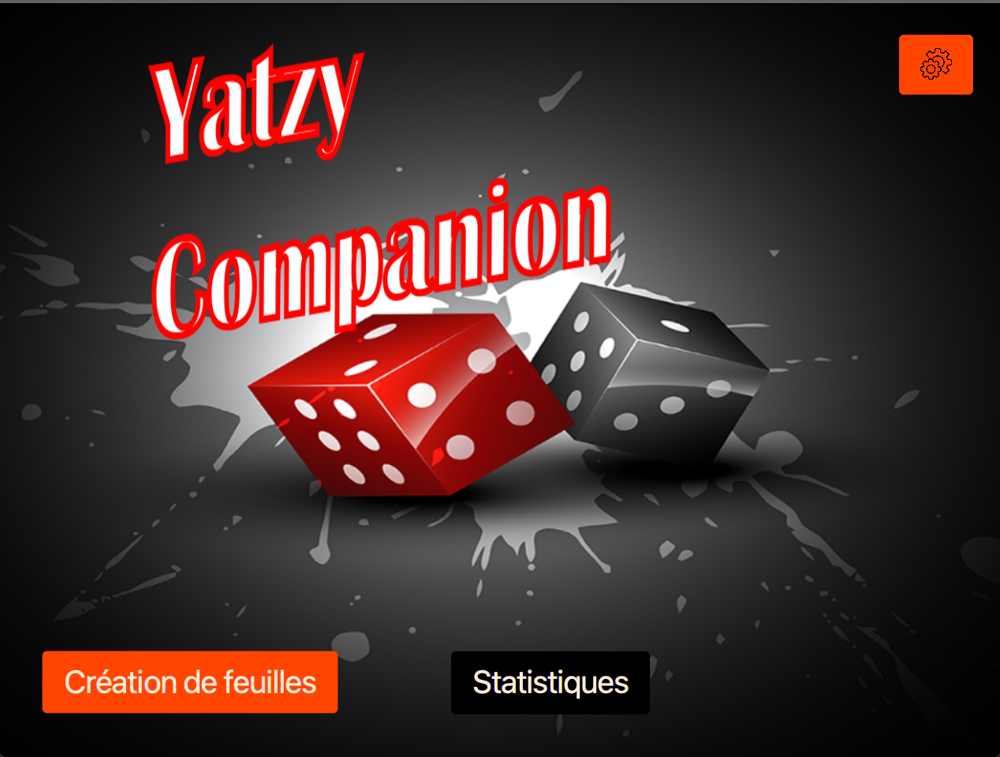
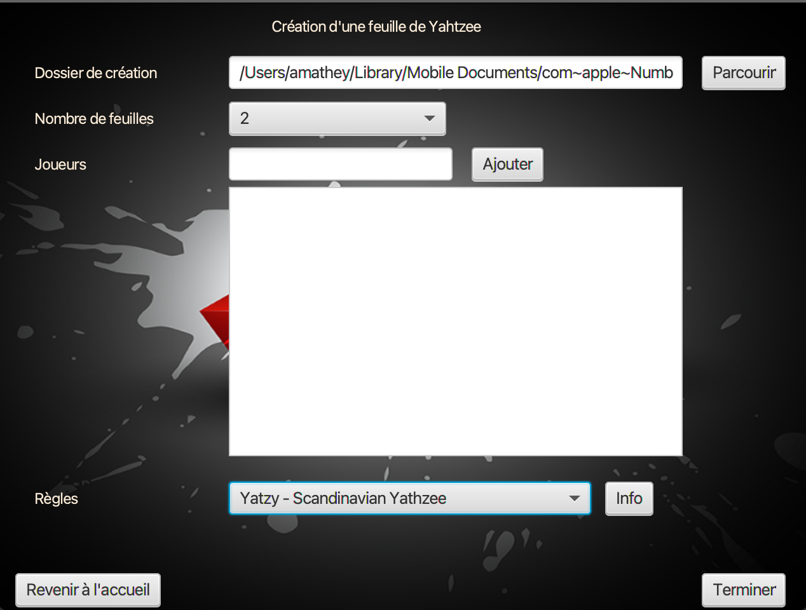
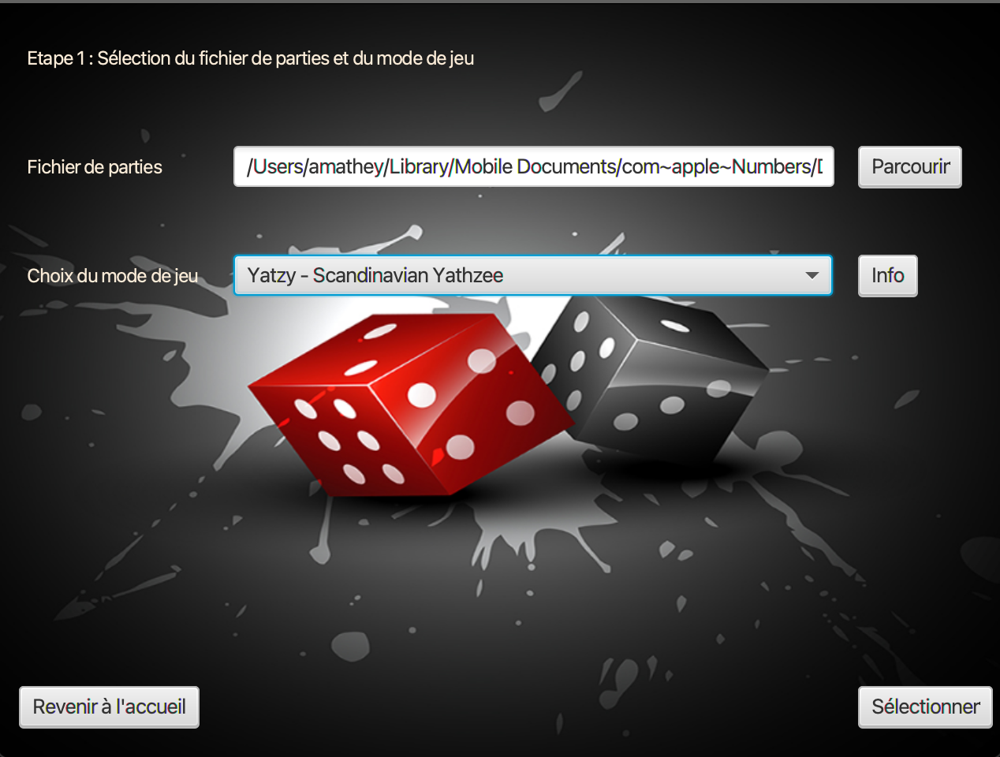
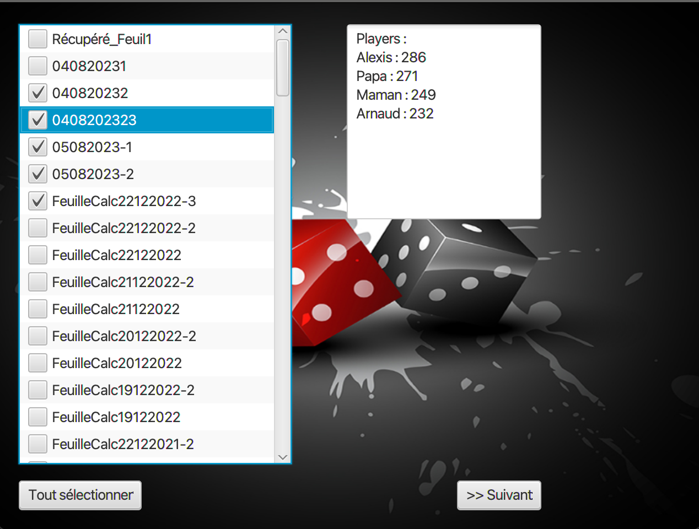
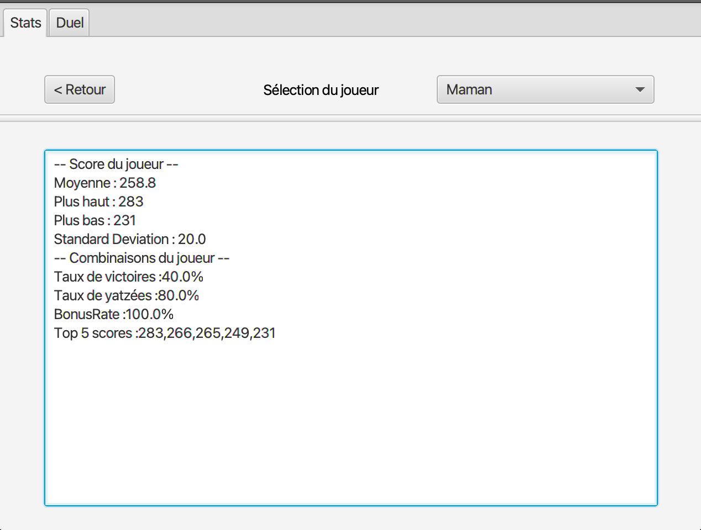
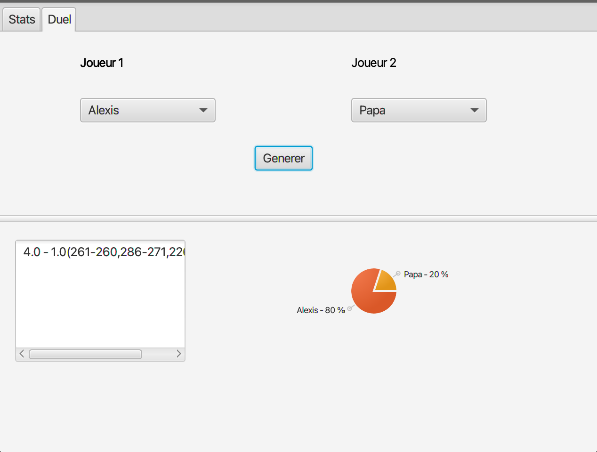
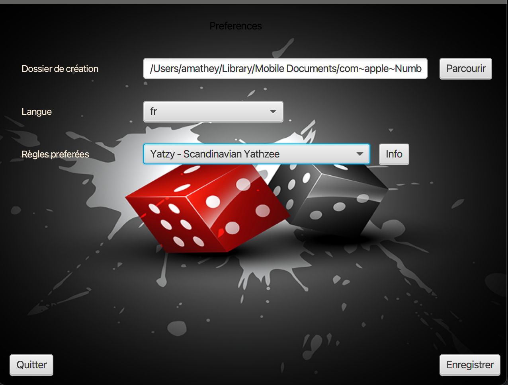
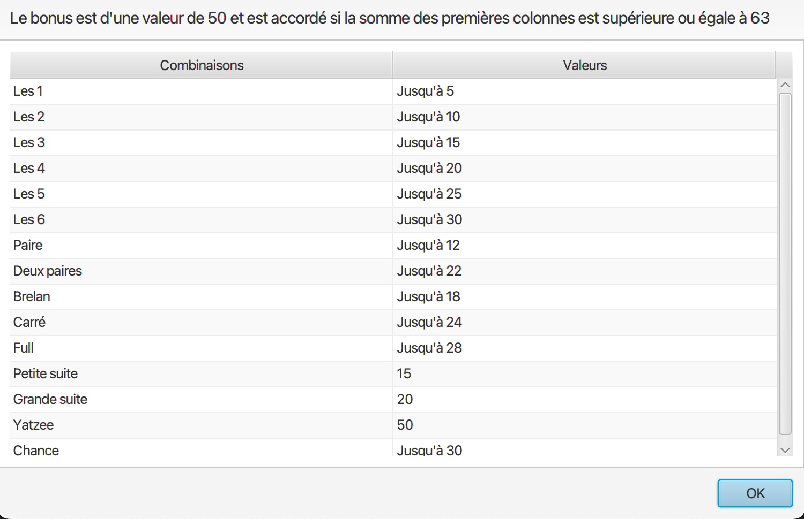

# YatzyCompanion

Welcome on **YatzyCompanion** dev page. Here is some features of this **amazing project**

## Yatzy sheet generator feature

You can generate a yatzy sheet Excel file specifying these informations: 
1. The folder which will be containing the file.
It is possible to add some games to an existing Excel file.
2. The number of sheets to generate inside the Excel Sheet.
3. All the players that will be playing
4. It is actually possible to choose between two Yatzy game formats.
    - Scandinavian Yatzy
    - 6 dice Yatzy, also called Maxi Yatzy

Future improvements : 
- Currently, .xlsx is the only file format which can be used for sheet generation.  
It will be possible to use .csv as well as a file extension

## Yatzy statistics feature

The yatzy statistics process has three steps. 

### Yatzy file selection

The Yatzy companion asks you to provide these two informations :
- A file which must be in a XLSX format
- The set of rules which has been used to create the games. This can be
  - Scandinavian Yatzy
  - 6 dice Yatzy, also called Maxi Yatzy

User preferences can be stored in the application to help you :.
-> Finding The Excel file you use to save your games
-> Automatically selecting your preferred yathzee game rules

In the next step, the companion is scanning the provided file and searches for played games.  
Some Yatzy sheets in the Excel file may not be not recognized by the companion.  
If this happens, these sheets will be appearing in a dialog with the problem encountered while the sheet reading.

Future improvements :
- Currently, .xlsx is the only file format which can be used for sheet reading.  
  It will be possible to use .csv as well as a file extension
- It will also be possible to get your files from Google Drive Cloud

### Yatzy sheets selector

All the sheets of the Excel file and only those with the applied rules are available. 
It is possible to consult info about the players and their scores. 

Future improvements : 
 - Some filters will be available to allow a better selection of the games

### Global stats Tab

When the sheets are selected, the statistics tab appears. 
Some data are viewable for each players as bonus rate, yatzy rates, win percentage. 

Future improvements: 
- Redesign the window
- Add some more stats

The duel tab allows two users to compare their scores. 
When two player names are selected, 

-> Total wins for each player when playing together
-> The last 3 games with their scores
-> A piechart with winning player percentages

Future improvements : 
- Improve 3 last matches UI
- Piechart is buggy

## Global settings tab

Allows the player to save its file or rules preferences. 
_**Application is in French language and is not translated in English yet._** 

Some informations about the rules are available when clicking on Info button.

Future improvements : 
- Allow the users to include and import their own rules in the application

## Installing the project

**For customers** : installation link will be included for MAC and Windows users.

**For devs** : project has been developed in Java 17 with Maven, Java FX, Scenebuilder and IntelliJ. 
Project can be launched with the command **maven compile javafx:run**
